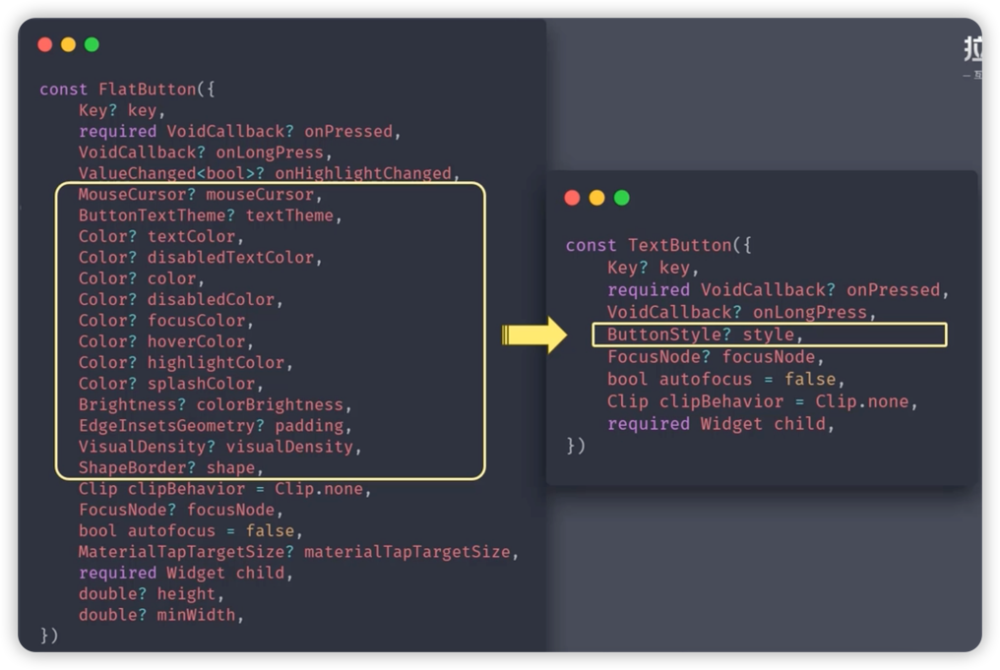
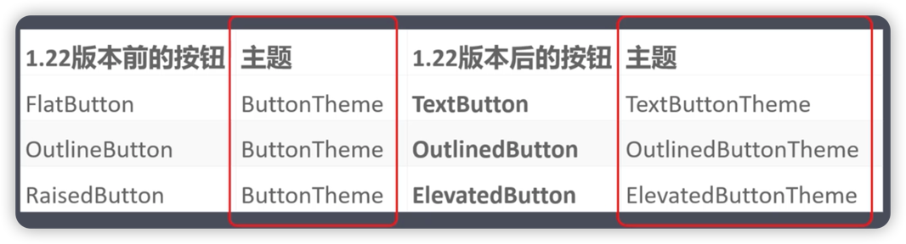
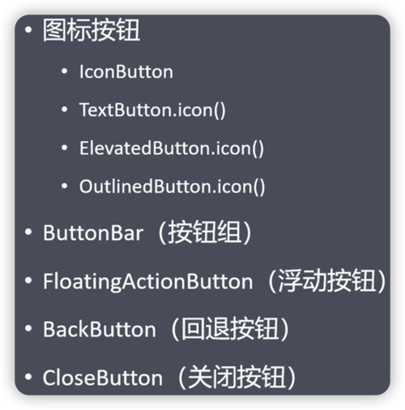

# 按钮

### Flutter 1.22之前
* FlatButton 扁平按钮
* RaisedButton 凸起按钮
* OutlineButton 轮廓按钮

### Flutter 1.22之后
* TextButton 文本按钮（用来替换FlatButton）
* ElevatedButton 抬高按钮（用来替换RaisedButton）
* OutlinedButton 轮廓按钮（用来替换OutlineButton）

### 为什么会出现新按钮？
1. 旧按钮同一外观比较麻烦，经常自定义大量按钮样式；新按钮将外观属性集合为一个ButtonStyle，方便统一控制。

### 按钮主题

    ### 其它按钮

***
[运行代码](code/Button.dart)
