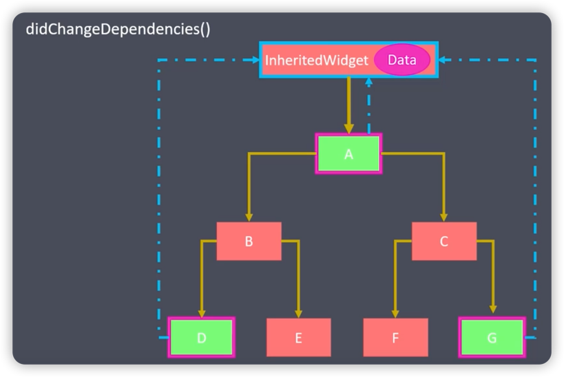
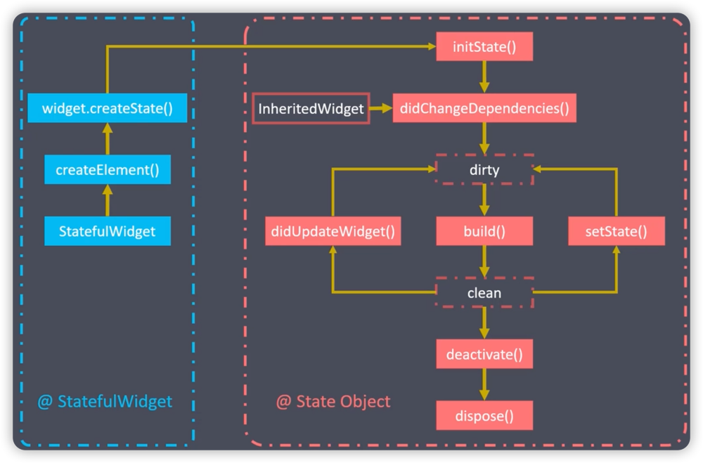

# 生命周期

[运行代码](code/LifeCycle.dart)

### initState(只会被调用一次)
组件对象插入到元素树时。

### didChangeDependencies()
当前状态的对象依赖改变时。

例如，如果组件D修改了Data，那么A和G就会被调用didChangeDependencies来响应数据修改。

### build()
组件渲染时，每次调用setState之后都会被调用.

### setState()
组件对象的内部状态改变时

### didUpdateWidget 
组件配置更新时(例如多主题或多语言)

### deactivate
组件对象在元素树中暂时被移除时(例如切换页面)

### dispose
组件对象在元素树木中永远被移除时(例如关闭应用)

***

