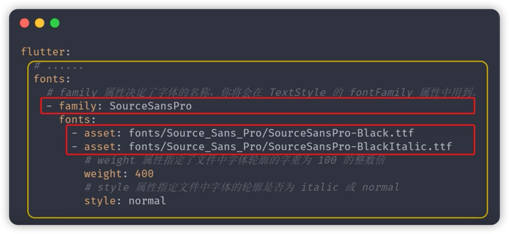

# Text - 文本组件
* TextDirection 文本方向
* TextStyle 文本样式
    * Colors 文本颜色
    * FontWeight 字体粗细
    * FontStyle 字体样式
* TextAlign 文本对齐
* TextOverflow 文本溢出处理
* maxLines 指定显示的最大行数

RichText与TextSpan 富文本组件，给一段文本声明多个样式

## 设置自定义字体



### <font color=#33a3dc>**STEP1**</font> 在<font color=#dea32c>**pubspec.yaml**</font>中配置自定义字体
``` yaml
  # pubspec.yaml
  fonts:
    - family: Selima
      fonts:
        - asset: fonts/Selima.ttf
          weight: 300
          style: italic
```

### <font color=#33a3dc>**STEP2**</font> 使用自定义字体

``` dart 
MaterialApp(
  theme: ThemeData(
    // 配置全局自定义字体
    fontFamily:"Selima"
  )
)
```

``` dart
Text(
  style: TextStyle(
    // 针对单个Text设置自定义字体
    fontFamily: "Selima"
  )
)
```

***
[运行代码](code/Text文本组件.dart)
 
    