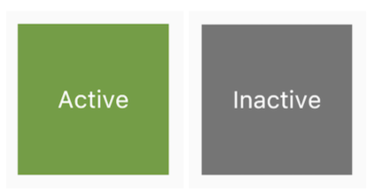

# 状态管理
***
在 Widget 内部管理状态封装性会好一些，而在父 Widget 中管理会比较灵活。

有些时候，如果不确定到底该怎么管理状态，那么推荐的首选是在父 Widget 中管理（灵活会显得更重要一些）。

## 示例

接下来，我们将通过创建三个简单示例TapboxA、TapboxB和TapboxC来说明管理状态的不同方式。 

这些例子功能是相似的 ——创建一个盒子，当点击它时，盒子背景会在绿色与灰色之间切换。状态 _active确定颜色：绿色为true ，灰色为false，如图2-8所示：



下面的例子将使用GestureDetector来识别点击事件。

### Widget管理自身状态
``` dart
//------------------------- TapboxA ----------------------------------

class TapboxA extends StatefulWidget {
  TapboxA({Key? key}) : super(key: key);

  @override
  _TapboxAState createState() => _TapboxAState();
}

class _TapboxAState extends State<TapboxA> {
  // 定义_active：确定盒子的当前颜色的布尔值
  bool _active = false;
  
  // 定义_handleTap()函数，该函数在点击该盒子时更新_active，并调用setState()更新UI
  void _handleTap() {
    setState(() {
      _active = !_active;
    });
  }

  Widget build(BuildContext context) {
    return GestureDetector(
      onTap: _handleTap,
      child: Container(
        child: Center(
          child: Text(
            _active ? 'Active' : 'Inactive',
            style: TextStyle(fontSize: 32.0, color: Colors.white),
          ),
        ),
        width: 200.0,
        height: 200.0,
        // 设置装饰，根据_active来设置背景色
        decoration: BoxDecoration(
          color: _active ? Colors.lightGreen[700] : Colors.grey[600],
        ),
      ),
    );
  }
}
```

### 父Widget管理子Widget的状态
``` dart
//------------------------ ParentWidget --------------------------------

class ParentWidget extends StatefulWidget {
  @override
  _ParentWidgetState createState() => _ParentWidgetState();
}

class _ParentWidgetState extends State<ParentWidget> {
  // 为TapboxB 管理_active状态
  bool _active = false;
  
  // 实现_handleTapboxChanged()，当盒子被点击时调用的方法
  void _handleTapboxChanged(bool newValue) {
    // 当状态改变时，调用setState()更新UI
    setState(() {
      _active = newValue;
    });
  }

  @override
  Widget build(BuildContext context) {
    return Container(
      child: TapboxB(
        active: _active,
        onChanged: _handleTapboxChanged,
      ),
    );
  }
}
```
``` dart
//------------------------- TapboxB ----------------------------------
/// 继承StatelessWidget类，因为所有状态都由其父组件处理
class TapboxB extends StatelessWidget {
  TapboxB({Key? key, this.active: false, required this.onChanged})
      : super(key: key);
  
  final bool active;
  final ValueChanged<bool> onChanged;

  void _handleTap() {
    onChanged(!active);
  }

  Widget build(BuildContext context) {
    return GestureDetector(
      // 当检测到点击时，它会通知父组件
      onTap: _handleTap,
      child: Container(
        child: Center(
          child: Text(
            active ? 'Active' : 'Inactive',
            style: TextStyle(fontSize: 32.0, color: Colors.white),
          ),
        ),
        width: 200.0,
        height: 200.0,
        decoration: BoxDecoration(
          color: active ? Colors.lightGreen[700] : Colors.grey[600],
        ),
      ),
    );
  }
}
```
### 混合状态管理
对于一些组件来说，混合管理的方式会非常有用。在这种情况下，组件自身管理一些内部状态，而父组件管理一些其他外部状态。

在下面 TapboxC 示例中，手指按下时，盒子的周围会出现一个深绿色的边框，抬起时，边框消失。点击完成后，盒子的颜色改变。 TapboxC 将其_active状态导出到其父组件中，但在内部管理其_highlight状态。这个例子有两个状态对象_ParentWidgetState和_TapboxCState。

``` dart
//---------------------------- ParentWidget ----------------------------

class ParentWidgetC extends StatefulWidget {
  @override
  _ParentWidgetCState createState() => _ParentWidgetCState();
}

class _ParentWidgetCState extends State<ParentWidgetC> {
  // 管理_active 状态
  bool _active = false;
  
  // 实现 _handleTapboxChanged() ，当盒子被点击时调用
  void _handleTapboxChanged(bool newValue) {
    // 当点击盒子并且_active状态改变时调用setState()更新UI
    setState(() {
      _active = newValue;
    });
  }

  @override
  Widget build(BuildContext context) {
    return Container(
      child: TapboxC(
        active: _active,
        onChanged: _handleTapboxChanged,
      ),
    );
  }
}
```
``` dart
//----------------------------- TapboxC ------------------------------

class TapboxC extends StatefulWidget {
  TapboxC({Key? key, this.active: false, required this.onChanged})
      : super(key: key);

  final bool active;
  final ValueChanged<bool> onChanged;
  
  @override
  _TapboxCState createState() => _TapboxCState();
}

class _TapboxCState extends State<TapboxC> {
  // 管理_highlight 状态
  bool _highlight = false;

  void _handleTapDown(TapDownDetails details) {
    setState(() {
      _highlight = true;
    });
  }

  void _handleTapUp(TapUpDetails details) {
    setState(() {
      _highlight = false;
    });
  }

  void _handleTapCancel() {
    setState(() {
      _highlight = false;
    });
  }

  void _handleTap() {
    widget.onChanged(!widget.active);
  }

  @override
  Widget build(BuildContext context) {
    // GestureDetector监听所有tap事件。当
    // 用户点下时，它添加高亮（深绿色边框）；当用户释放时，会移除高亮
    return GestureDetector(
      onTapDown: _handleTapDown, // 处理按下事件
      onTapUp: _handleTapUp, // 处理抬起事件
      onTap: _handleTap,
      onTapCancel: _handleTapCancel,
      child: Container(
        child: Center(
          child: Text(
            widget.active ? 'Active' : 'Inactive',
            style: TextStyle(fontSize: 32.0, color: Colors.white),
          ),
        ),
        width: 200.0,
        height: 200.0,
        decoration: BoxDecoration(
          color: widget.active ? Colors.lightGreen[700] : Colors.grey[600],
          border: _highlight
              ? Border.all(
                  color: Colors.teal[700],
                  width: 10.0,
                )
              : null,
        ),
      ),
    );
  }
}
```

### 全局状态管理
当应用中需要一些跨组件（包括跨路由）的状态需要同步时，上面介绍的方法便很难胜任了。
> 比如，我们有一个设置页，里面可以设置应用的语言，我们为了让设置实时生效，我们期望在语言状态发生改变时，App中依赖应用语言的组件能够重新 build 一下，但这些依赖应用语言的组件和设置页并不在一起，所以这种情况用上面的方法很难管理。

这时，正确的做法是通过一个全局状态管理器来处理这种相距较远的组件之间的通信。

#### 方法
1. 实现一个全局的事件总线。
> 将语言状态改变对应为一个事件，然后在APP中依赖应用语言的组件的initState 方法中订阅语言改变的事件。当用户在设置页切换语言后，我们发布语言改变事件，而订阅了此事件的组件就会收到通知，收到通知后调用setState(...)方法重新build一下自身即可。
2. 使用一些专门用于状态管理的包。
> 如 Provider、Redux。