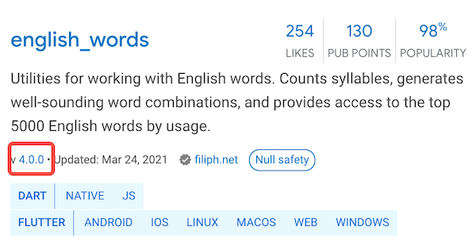
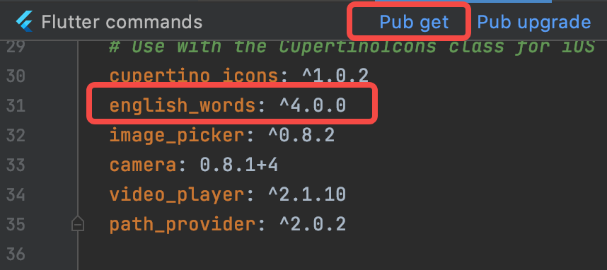

# 包管理
***
## 包Package
在软件开发中，很多时候有一些公共的库或 SDK 可能会被很多项目用到。

因此，将这些代码单独抽到一个独立模块，然后哪个项目需要使用时再直接集成这个模块，便可大大提高开发效率。如：

1. Java 语言中这种独立模块会被打成一个 jar 包
2. Android 中的 aar 包
3. Web开发中的 npm 包

为了方便表述，我们将这种可共享的独立模块统一称为“包”（ Package）。
***
## 包管理工具
一个 App 在实际开发中往往会依赖很多包，而这些包通常都有交叉依赖关系、版本依赖等。

各种开发生态或编程语言官方通常都会提供一些包管理工具，比如：
1. 在 Android 提供了 Gradle 来管理依赖
2. iOS 用 Cocoapods 或 Carthage 来管理依赖
3. Node 中通过 npm

在 Flutter 开发中也有自己的包管理工具pubspec.yaml（位于项目根目录）。
***
## pubspec.yaml
YAML 是一种直观、可读性高的文件格式。

和 xml 或 Json 相比它语法简单并非常容易解析，所以 YAML 常用于配置文件。

Flutter 也是用 yaml 文件作为其配置文件（pubspec.yaml）。

``` yaml
# 应用或包名称
name: flutter_in_action
# 应用或包的描述、简介
description: First Flutter Application.

# 应用或包的版本号
version: 1.0.0+1

# 应用或包依赖的其它包或插件
dependencies:
  flutter:
    sdk: flutter
  cupertino_icons: ^0.1.2

# 开发环境依赖的工具包（而不是flutter应用本身依赖的包）
# 只是作为开发阶段的一些工具包，主要是用于帮助我们提高开发、测试效率，
# 比如 flutter 的自动化测试包等
dev_dependencies:
  flutter_test:
    sdk: flutter

# flutter相关的配置选项    
flutter:
  uses-material-design: true
```
***
## Pub仓库
Pub（https://pub.dev/ ）是 Google 官方的 Dart Packages 仓库。

类似于 node 中的 npm仓库、Android中的 jcenter。

我们可以在 Pub 上面查找需要的包和插件，也可以向 Pub 发布自己的包和插件。

### 示例 - 实现一个显示随机字符串的 widget
1. 在 pub 上找到 english_words 这个包。
2. 确定其最新的版本号和是否支持 Flutter。



3. 将“english_words” 添加到依赖项列表，如下：
``` yaml
dependencies:
  flutter:
    sdk: flutter
  # 新添加的依赖
  english_words: ^4.0.0
```

4. 下载包。在Android Studio的编辑器视图中查看pubspec.yaml时（图2-13），单击右上角的 Pub get 



这会将依赖包安装到您的项目。我们可以在控制台中看到以下内容：
``` dart
flutter packages get
Running "flutter packages get" in flutter_in_action...
Process finished with exit code 0
```

### 其它依赖方式
上文所述的依赖方式是依赖Pub仓库的。

但我们还可以依赖 本地包 和 git仓库 。

#### 依赖本地包
如果我们正在本地开发一个包，包名为pkg1，我们可以通过下面方式依赖：
 ``` yaml
dependencies:
    pkg1:
    path: ../../code/pkg1 # 路径可以是相对的，也可以是绝对的。
```

#### 依赖Git
也可以依赖存储在Git仓库中的包。如果软件包位于仓库的根目录中，请使用以下语法：
``` yaml
dependencies:
  pkg1:
    git:
      url: git://github.com/xxx/pkg1.git
```
上面假定包位于Git存储库的根目录中。如果不是这种情况，可以使用path参数指定相对位置，例如：
``` yaml
dependencies:
  package1:
    git:
      url: git://github.com/flutter/packages.git
      path: packages/package1    
```


