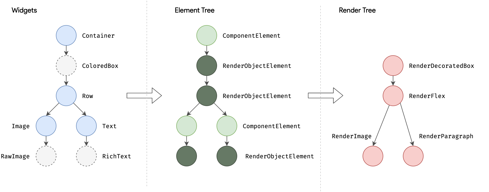

# Flutter中的四棵树🌳
***
🤔 既然 Widget 只是描述一个UI元素的配置信息，那么真正的布局、绘制是由谁来完成的呢？

<br>

Flutter 框架的的处理流程（元素树🌳 -> 渲染树🌳 -> 层级树🌳）
1. 根据 Widget 树生成一个 Element 树，Element 树中的节点都继承自 Element 类。
2. 根据 Element 树生成 Render 树（渲染树），渲染树中的节点都继承自RenderObject 类。
3. 根据渲染树生成 Layer 树，然后上屏显示，Layer 树中的节点都继承自 Layer 类。

<br>

真正的布局和渲染逻辑在渲染树中，Element 是 Widget 和 RenderObject 的粘合剂，可以理解为一个中间代理：
``` dart
Container( // 一个容器 widget
  /// 如果 Container 设置了背景色，Container 内部会创建一个新的 ColoredBox 来填充背景，
  /// if (color != null)
  ///   current = ColoredBox(color: color!, child: current);
  color: Colors.blue, // 设置容器背景色
  
  child: Row( // 可以将子widget沿水平方向排列
    children: [
      /// Image 内部会通过 RawImage 来渲染图片
      Image.network('https://www.example.com/1.png'), // 显示图片的 widget
      
      /// Text 内部会通过 RichText 来渲染文本
      const Text('A'),
    ],
  ),
);
```

最终的 Widget树、Element 树、渲染树结构如图所示
> 
> 1. 三棵树中，Widget 和 Element 是一一对应的，但并不和 RenderObject 一一对应。比如 StatelessWidget 和 StatefulWidget 都没有对应的 RenderObject。
> 2. 渲染树在上屏前会生成一棵 Layer 树，这个将在后面原理篇介绍。
> 
> 