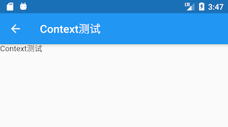

# StatelessWidget
***
StatelessWidget用于不需要维护状态的场景，它通常在build方法中通过嵌套其它 widget 来构建UI，在构建过程中会递归的构建其嵌套的 widget 。

``` dart
class Echo extends StatelessWidget  {
  
  const Echo({
    /// 在继承 widget 时，第一个参数通常应该是Key
    Key? key,  
    /// 命名参数中的必传参数要添加required关键字
    required this.text,
    this.backgroundColor = Colors.grey, //默认为灰色
    /// 如果 widget 需要接收子 widget ，
    /// 那么child或children参数通常应被放在参数列表的最后，
    /// 且应尽可能的被声明为final，防止被意外改变。
  }):super(key:key);
    
  final String text;
  final Color backgroundColor;
  
  /// context表示当前 widget 在 widget 树中的上下文，
  /// 每个 widget 都会对应一个 context 对象。
  @override
  Widget build(BuildContext context) {
    return Center(
      child: Container(
        color: backgroundColor,
        child: Text(text),
      ),
    );
  }
}
```

## Context
表示当前 widget 在 widget 树中的上下文，实际上，context是当前 widget 在 widget 树中位置中执行”相关操作“的一个句柄(handle)，

比如它提供了：
1. 从当前 widget 开始，向上遍历 widget 树。
2. 按照 widget 类型，查找父级 widget。

``` dart
class ContextRoute extends StatelessWidget  {
  @override
  Widget build(BuildContext context) {
    return Scaffold(
      appBar: AppBar(
        title: Text("Context测试"),
      ),
      body: Container(
        child: Builder(builder: (context) {
          // 在 widget 树中向上查找最近的父级`Scaffold`  widget 
          Scaffold scaffold = context.findAncestorWidgetOfExactType<Scaffold>();
          // 直接返回 AppBar的title， 此处实际上是Text("Context测试")
          return (scaffold.appBar as AppBar).title;
        }),
      ),
    );
  }
}
```
运行效果：

