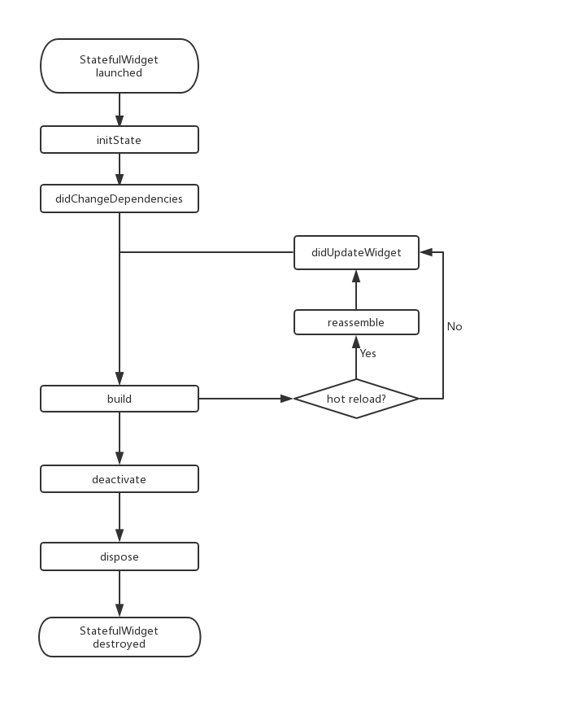

# State
***
一个 StatefulWidget 类会对应一个 State 类，State表示与其对应的 StatefulWidget 要维护的状态。

<br>

State 中的保存的状态信息可以：
1. 在 widget 构建时可以被同步读取。
2. 在 widget 生命周期中可以被改变，当State被改变时，可以手动调用其setState()方法通知Flutter 框架状态发生改变，Flutter 框架在收到消息后，会重新调用其build方法重新构建 widget 树，从而达到更新UI的目的。

<br>

State 中有两个常用属性：
1. widget，它表示与该 State 实例关联的 widget 实例，由Flutter 框架动态设置。注意，这种关联并非永久的，因为在应用生命周期中，UI树上的某一个节点的 widget 实例在重新构建时可能会变化，但State实例只会在第一次插入到树中时被创建，当在重新构建时，如果 widget 被修改了，Flutter 框架会动态设置State. widget 为新的 widget 实例。
2. context，StatefulWidget对应的 BuildContext，作用同StatelessWidget 的BuildContext。

## State生命周期
``` dart
class CounterWidget extends StatefulWidget {
  const CounterWidget({Key? key, this.initValue = 0});

  final int initValue;

  @override
  _CounterWidgetState createState() => _CounterWidgetState();
}
```
``` dart
class _CounterWidgetState extends State<CounterWidget> {
  int _counter = 0;
  
  /// 当 widget 第一次插入到 widget 树时会被调用，
  /// 
  /// 对于每一个State对象，Flutter 框架只会调用一次该回调，
  /// 
  /// 通常在该回调中做一些一次性的操作，
  /// 如状态初始化、订阅子树的事件通知等。
  /// 
  /// 不能在该回调中调用BuildContext.dependOnInheritedWidgetOfExactType
  ///（该方法用于在 widget 树上获取离当前 widget 最近的一个父级InheritedWidget），
  /// 原因是在初始化完成后， widget 树中的InheritFrom widget也可能会发生变化，
  /// 所以正确的做法应该在在build（）方法或didChangeDependencies()中调用它。
  @override
  void initState() {
    super.initState();
    //初始化状态
    _counter = widget.initValue;
    print("initState");
  }
  
  /// 主要是用于构建 widget 子树的
  ///
  /// 会在如下场景被调用：
  /// 1. 在调用initState()之后。
  /// 2. 在调用didUpdateWidget()之后。
  /// 3. 在调用setState()之后。
  /// 4. 在调用didChangeDependencies()之后。
  /// 5. 在State对象从树中一个位置移除后（会调用deactivate）又重新插入到树的其它位置之后。
  @override
  Widget build(BuildContext context) {
    print("build");
    return Scaffold(
      body: Center(
        child: TextButton(
          child: Text('$_counter'),
          //点击后计数器自增
          onPressed: () => setState(
            () => ++_counter,
          ),
        ),
      ),
    );
  }
  
  /// 在 widget 重新构建时，Flutter会调用widget.canUpdate来检测 widget 树中同一位置的新旧节点，
  /// 然后决定是否需要更新，如果widget.canUpdate返回true则会调用此回调。
  /// 
  /// widget.canUpdate会在新旧 widget 的 key 和 runtimeType 同时相等时会返回true，
  /// 也就是说在在新旧 widget 的key和runtimeType同时相等时didUpdateWidget()就会被调用。
  @override
  void didUpdateWidget(CounterWidget oldWidget) {
    super.didUpdateWidget(oldWidget);
    print("didUpdateWidget ");
  }
  
  /// 当 State 对象从树中被移除时，会调用此回调。
  /// 在一些场景下，Flutter会将 State 对象重新插到树中，
  /// 如包含此 State 对象的子树在树的一个位置移动到另一个位置时（可以通过GlobalKey 来实现）。
  /// 如果移除后没有重新插入到树中则紧接着会调用dispose()方法。
  @override
  void deactivate() {
    super.deactivate();
    print("deactivate");
  }
  
  /// 当 State 对象从树中被永久移除时调用；通常在此回调中释放资源
  @override
  void dispose() {
    super.dispose();
    print("dispose");
  }
  
  /// 专门为了开发调试而提供的，在热重载(hot reload)时会被调用，
  /// 此回调在Release模式下永远不会被调用。
  @override
  void reassemble() {
    super.reassemble();
    print("reassemble");
  }
  
  /// 当State对象的依赖发生变化时会被调用；
  ///
  /// 例如：在之前build() 中包含了一个InheritedWidget，
  /// 然后在之后的build() 中Inherited widget发生了变化，
  /// 那么此时InheritedWidget的子 widget 的didChangeDependencies()回调都会被调用。
  /// 
  /// 典型的场景是当系统语言 Locale 或应用主题改变时，
  /// Flutter 框架会通知 widget 调用此回调。
  ///
  /// 需要注意，组件第一次被创建后挂载的时候（包括重创建）对应的didChangeDependencies也会被调用。
  @override
  void didChangeDependencies() {
    super.didChangeDependencies();
    print("didChangeDependencies");
  }
}
```

### 生命周期1：运行应用并打开页面
```
I/flutter ( 5436): initState
I/flutter ( 5436): didChangeDependencies
I/flutter ( 5436): build
```

### 生命周期2：点击⚡按钮热重载
``` 
I/flutter ( 5436): reassemble
I/flutter ( 5436): didUpdateWidget 
I/flutter ( 5436): build
```

### 生命周期3：在 widget 树中移除CounterWidget再热重载
``` dart
Widget build(BuildContext context) {
  //移除计数器 
  //return CounterWidget ();
  //随便返回一个Text()
  return Text("xxx");
}
```
``` 
I/flutter ( 5436): reassemble
I/flutter ( 5436): deactive
I/flutter ( 5436): dispose
```
### StatefulWidget生命周期图
