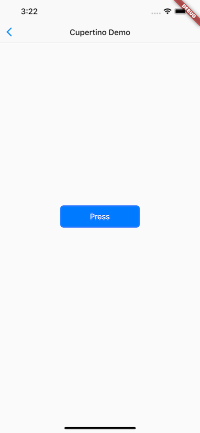

# Flutter SDK内置组件库介绍
***

Flutter 提供了一套丰富、强大的基础组件，在基础组件库之上 Flutter 又提供了一套 Material 风格（ Android 默认的视觉风格）和一套 Cupertino 风格（iOS视觉风格）的组件库。要使用基础组件库，需要先导入：

``` dart
import 'package:flutter/widgets.dart';
```

## 常用基础组件
1. Text ：该组件可让您创建一个带格式的文本。
2. Row 、 Column ： 这些具有弹性空间的布局类 widget 可让您在水平（Row）和垂直（Column）方向上创建灵活的布局。其设计是基于 Web 开发中的 Flexbox 布局模型。
3. Stack ： 取代线性布局 (译者语：和 Android 中的FrameLayout相似)，[Stack](https://docs.flutter.io/flutter/ widgets/Stack-class.html)允许子 widget 堆叠， 你可以使用 Positioned 来定位他们相对于Stack的上下左右四条边的位置。Stacks是基于Web开发中的绝对定位（absolute positioning )布局模型设计的。
4. Container ： Container 可让您创建矩形视觉元素。Container 可以装饰一个BoxDecoration , 如 background、一个边框、或者一个阴影。 Container 也可以具有边距（margins）、填充(padding)和应用于其大小的约束(constraints)。另外， Container 可以使用矩阵在三维空间中对其进行变换。

## Material组件
1. Flutter 提供了一套丰富 的Material 组件，它可以帮助我们构建遵循 Material Design 设计规范的应用程序。
2. Material 应用程序以MaterialApp  组件开始， 该组件在应用程序的根部创建了一些必要的组件，比如：
    1. Theme：用于配置应用的主题。
3. 是否使用MaterialApp 完全是可选的，但是使用它是一个很好的做法。
4. 要使用 Material 组件，需要先引入它：
> import 'package:flutter/material.dart';

## Cupertino组件
1. Flutter 也提供了一套丰富的 Cupertino 风格的组件，尽管目前还没有 Material 组件那么丰富，但是它仍在不断的完善中。
2. 值得一提的是在 Material 组件库中有一些组件可以根据实际运行平台来切换表现风格。
> 比如MaterialPageRoute，在路由切换时，如果是 Android 系统，它将会使用 Android 系统默认的页面切换动画(从底向上)；如果是 iOS 系统，它会使用 iOS 系统默认的页面切换动画（从右向左）。

``` dart
//导入cupertino  widget 库
import 'package:flutter/cupertino.dart';

class CupertinoTestRoute extends StatelessWidget  {
  @override
  widget build(BuildContext context) {
  
    return CupertinoPageScaffold(
    
      navigationBar: CupertinoNavigationBar(
        middle: Text("Cupertino Demo"),
      ),
      
      child: Center(
        child: CupertinoButton(
            color: CupertinoColors.activeBlue,
            child: Text("Press"),
            onPressed: () {}
        ),
      ),
      
    );
    
  }
}
```



## 总结
1. Flutter 提供了丰富的组件，在实际的开发中我们可以根据需要随意使用它们，而不必担心引入过多组件库会让你的应用安装包变大，这不是 web 开发，dart 在编译时只会编译你使用了的代码。
2. 由于 Material 和Cupertino 都是在基础组件库之上的，所以如果我们的应用中引入了这两者之一，则不需要再引入flutter/ widgets.dart了。

