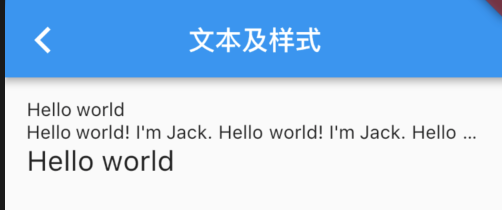
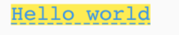
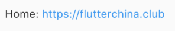
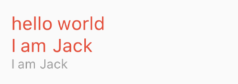

# 文本及样式

## Text
用于显示简单样式文本
``` dart
Text("Hello world",
  /// 文本的对齐方式；可以选择左对齐、右对齐还是居中。
  /// 注意，对齐的参考系是Text widget 本身。
  /// 即textAlign类似于Android中的layout:gravity属性
  textAlign: TextAlign.left,
);

Text("Hello world! I'm Jack. "*4,
  /// 指定文本显示的最大行数
  maxLines: 1,
  /// 如果有多余的文本，可以通过overflow来指定截断方式，默认是直接截断
  /// extOverflow.ellipsis会将多余文本截断后以省略符“...”表示
  overflow: TextOverflow.ellipsis,
);

Text("Hello world",
  /// 代表文本相对于当前字体大小的缩放因子，
  /// 相对于去设置文本的样式style属性的fontSize，它是调整字体大小的一个快捷方式
  /// 该属性的默认值可以通过MediaQueryData.textScaleFactor获得
  textScaleFactor: 1.5,
);
```



## TextStyle
用于指定文本显示的样式如颜色、字体、粗细、背景等。
``` dart
Text("Hello world",
  style: TextStyle(
    color: Colors.blue,
    /// 可以精确指定字体大小
    fontSize: 18.0,
    /// 该属性用于指定行高，但它并不是一个绝对值，而是一个因子，
    /// 具体的行高等于fontSize*height
    height: 1.2,  
    /// 由于不同平台默认支持的字体集不同，
    /// 所以在手动指定字体时一定要先在不同平台测试一下。
    fontFamily: "Courier",
    background: Paint()..color=Colors.yellow,
    decoration:TextDecoration.underline,
    decorationStyle: TextDecorationStyle.dashed
  ),
);
```


## TextSpan
如果需要对一个 Text 内容的不同部分按照不同的样式显示，这时就可以使用TextSpan
``` dart
const TextSpan({
  /// 文本片段的样式
  TextStyle style, 
  /// 文本片段的内容
  Sting text,
  /// TextSpan的数组，也就是说TextSpan可以包括其他TextSpan
  List<TextSpan> children,
  /// 用于对该文本片段上用于手势进行识别处理
  GestureRecognizer recognizer,
});
```



``` dart
Text.rich(TextSpan(
    children: [
     TextSpan(
       text: "Home: "
     ),
     TextSpan(
       text: "https://flutterchina.club",
       style: TextStyle(
         color: Colors.blue
       ),  
       recognizer: _tapRecognizer
     ),
    ]
))
```

## DefaultTextStyle

在 Widget 树中，文本的样式默认是可以被继承的（子类文本类组件未指定具体样式时可以使用 Widget 树中父级设置的默认样式），

因此，如果在 Widget 树的某一个节点处设置一个默认的文本样式，那么该节点的子树中所有文本都会默认使用这个样式，而DefaultTextStyle正是用于设置默认文本样式的。

``` dart
DefaultTextStyle(
  /// 1.设置文本默认样式 
  /// child 的所有子孙 Text 默认都会继承该样式 
  style: TextStyle(
    color:Colors.red,
    fontSize: 20.0,
  ),
  textAlign: TextAlign.start,
  child: Column(
    crossAxisAlignment: CrossAxisAlignment.start,
    children: <Widget>[
      Text("hello world"),
      Text("I am Jack"),
      Text("I am Jack",
        /// 2. 如果显示指定了style，则不继承默认样式
        style: TextStyle(
          inherit: false, 
          color: Colors.grey
        ),
      ),
    ],
  ),
);
```



## 字体

可以在 Flutter 应用程序中使用不同的字体。

>例如，我们可能会使用设计人员创建的自定义字体，或者其它第三方的字体，如 Google Fonts 中的字体。本节将介绍如何为 Flutter 
> 应用配置字体，并在渲染文本时使用它们。

在 Flutter 中使用字体分两步完成。
1. 首先在pubspec.yaml中声明它们，以确保它们会打包到应用程序中。
2. 然后通过TextStyle属性使用字体。

### 在asset中声明
``` yaml
flutter:
  fonts:
    - family: Raleway
      fonts:
        - asset: assets/fonts/Raleway-Regular.ttf
        - asset: assets/fonts/Raleway-Medium.ttf
          weight: 500
        - asset: assets/fonts/Raleway-SemiBold.ttf
          weight: 600
    - family: AbrilFatface
      fonts:
        - asset: assets/fonts/abrilfatface/AbrilFatface-Regular.ttf      
```

### 使用字体
``` dart
// 声明文本样式
const textStyle = const TextStyle(
  fontFamily: 'Raleway',
);

// 使用文本样式
var buttonText = const Text(
  "Use the font for this text",
  style: textStyle,
);
```

### Package中的字体
要使用 Package 中定义的字体，必须提供package参数。

``` dart
const textStyle = const TextStyle(
  fontFamily: 'Raleway',
  /// 设上面的字体声明位于my_package包中
  /// 如果在 package 包内部使用它自己定义的字体，也应该在创建文本样式时指定package参数
  package: 'my_package', //指定包名
);
```

### lib下的字体
一个包也可以只提供字体文件而不需要在 pubspec.yaml 中声明。 

这些文件应该存放在包的lib/文件夹中。

字体文件不会自动绑定到应用程序中，应用程序可以在声明字体时有选择地使用这些字体。

假设一个名为my_package的包中有一个字体文件：
```
lib/fonts/Raleway-Medium.ttf
```
然后，应用程序可以声明一个字体，如下面的示例所示：
``` yaml
flutter:
   fonts:
     - family: Raleway
       fonts:
         - asset: assets/fonts/Raleway-Regular.ttf
         # lib/是隐含的，所以它不应该包含在 asset 路径中。
         - asset: packages/my_package/fonts/Raleway-Medium.ttf
           weight: 500
```

在这种情况下，由于应用程序本地定义了字体，所以在创建TextStyle时可以不指定package参数：

``` dart
const textStyle = const TextStyle(
  fontFamily: 'Raleway',
);
```


