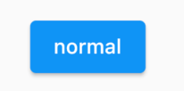
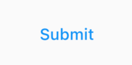
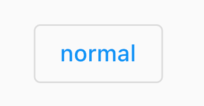
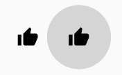
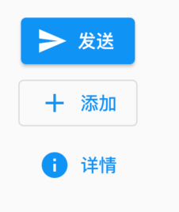

# 按钮
Material 组件库中提供了多种按钮组件，如ElevatedButton、TextButton、OutlineButton等。

它们都是直接或间接对<font color=#dea32c>**RawMaterialButton**</font>组件的包装定制。

所有 Material 库中的按钮都有如下相同点：

1. 按下时都会有“<font color=#dea32c>**水波动画**</font>”。
2. 有一个<font color=#dea32c>**onPressed**</font>属性来设置点击回调，当按钮按下时会执行该回调，如果不提供该回调则按钮会处于禁用状态，禁用状态不响应用户点击。

## ElevatedButton
即"漂浮"按钮，它默认带有阴影和灰色背景。按下后，阴影会变大，如图所示：



``` dart
ElevatedButton(
  child: Text("normal"),
  onPressed: () {},
);
```

## TextButton
文本按钮，默认背景透明并不带阴影。按下后，会有背景色，如图所示：



``` dart
TextButton(
  child: Text("normal"),
  onPressed: () {},
)
```

## OutlineButton
默认有一个边框，不带阴影且背景透明。按下后，边框颜色会变亮、同时出现背景和阴影(较弱)，如图所示：



``` dart
OutlineButton(
  child: Text("normal"),
  onPressed: () {},
)
```

## IconButton
一个可点击的Icon，不包括文字，默认没有背景，点击后会出现背景，如图所示：



``` dart
IconButton(
  icon: Icon(Icons.thumb_up),
  onPressed: () {},
)
```

## 带图标的按钮
ElevatedButton、TextButton、OutlineButton都有一个 icon 构造函数，通过它可以轻松创建带图标的按钮，如图所示：



``` dart
ElevatedButton.icon(
  icon: Icon(Icons.send),
  label: Text("发送"),
  onPressed: _onPressed,
),
OutlineButton.icon(
  icon: Icon(Icons.add),
  label: Text("添加"),
  onPressed: _onPressed,
),
TextButton.icon(
  icon: Icon(Icons.info),
  label: Text("详情"),
  onPressed: _onPressed,
),
```


