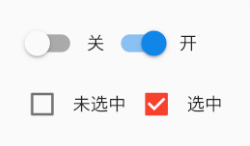

# 单选开关和复选框

Material 组件库中提供了 Material 风格的单选开关Switch和复选框Checkbox。

虽然它们都是继承自StatefulWidget，但它们本身不会保存当前选中状态，选中状态都是由父组件来管理的。

当Switch或Checkbox被点击时，会触发它们的**onChanged**回调，我们可以在此回调中处理选中状态改变逻辑。

***

[运行代码](code/单选开关和复选框.dart)

## 属性及外观
Switch和Checkbox属性比较简单，读者可以查看API文档，它们都有一个activeColor属性，用于设置激活态的颜色。

至于大小，到目前为止，Checkbox的大小是固定的，无法自定义，而Switch只能定义宽度，高度也是固定的。

值得一提的是Checkbox有一个属性tristate ，表示是否为三态，其默认值为false ，这时 Checkbox 有两种状态即“选中”和“不选中”，对应的 value 值为true和false ；如果tristate值为true时，value 的值会增加一个状态null，读者可以自行测试。