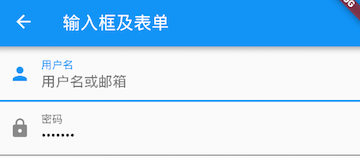

# 输入框及表单

Material 组件库中提供了输入框组件TextField和表单组件Form

## TextField
用于文本输入

``` dart
const TextField({
  ...
  /// 文本编辑中控制器
  /// 
  TextEditingController controller, 
  FocusNode focusNode,
  InputDecoration decoration = const InputDecoration(),
  TextInputType keyboardType,
  TextInputAction textInputAction,
  TextStyle style,
  TextAlign textAlign = TextAlign.start,
  bool autofocus = false,
  bool obscureText = false,
  int maxLines = 1,
  int maxLength,
  this.maxLengthEnforcement,
  ToolbarOptions? toolbarOptions,
  ValueChanged<String> onChanged,
  VoidCallback onEditingComplete,
  ValueChanged<String> onSubmitted,
  List<TextInputFormatter> inputFormatters,
  bool enabled,
  this.cursorWidth = 2.0,
  this.cursorRadius,
  this.cursorColor,
  this.onTap,
  ...
})
```

***

## 示例：登录输入框


[运行代码](code/登录输入框.dart)