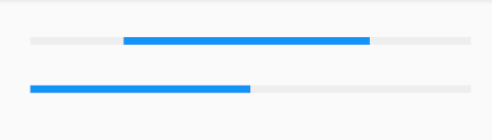
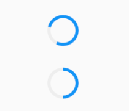
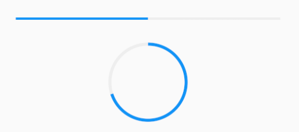

# 进度指示器

1. LinearProgressIndicator
2. CircularProgressIndicator
3. 自定义尺寸
4. 进度色动画
5. 自定义进度指示器样式

***

## LinearProgressIndicator
一个线性、条状的进度条
``` dart
LinearProgressIndicator({
  /// 表示当前的进度，取值范围为[0,1]
  /// 如果value为null时则指示器会执行一个循环动画（模糊进度）
  double value,
  /// 指示器的背景色
  Color backgroundColor,
  /// 指示器的进度条颜色
  /// 允许我们对进度条的颜色也可以指定动画
  /// 想对进度条应用一种固定的颜色，可以通过AlwaysStoppedAnimation来指定
  Animation<Color> valueColor,
  ...
})
```



[运行代码](code/LinearProgressIndicator.dart)

## CircularProgressIndicator
是一个圆形进度条

``` dart
CircularProgressIndicator({
  double value,
  Color backgroundColor,
  Animation<Color> valueColor,
  /// 表示圆形进度条的粗细
  this.strokeWidth = 4.0,
  ...   
}) 
```



[运行代码](code/CircularProgressIndicator.dart)

## 自定义尺寸
如果希望LinearProgressIndicator的线细一些，或者希望CircularProgressIndicator的圆大一些该怎么做？

可以通过尺寸限制类Widget，如ConstrainedBox、SizedBox （我们将在后面容器类组件一章中介绍）来指定尺寸。

[运行代码](code/自定义尺寸.dart)



## 进度色动画
实现一个进度条在3秒内从灰色变成蓝色的动画：

[运行代码](code/进度色动画.dart)

## 自定义进度指示器样式

定制进度指示器风格样式，可以通过<font color=#dea32c>**CustomPainter**</font> Widget 来自定义绘制逻辑。

实际上LinearProgressIndicator和CircularProgressIndicator也正是通过CustomPainter来实现外观绘制的。

关于CustomPainter，我们将在后面“自定义Widget”一章中详细介绍。

第三方库推荐：[flutter_spinkit 5.1.0](https://pub.flutter-io.cn/packages/flutter_spinkit)

