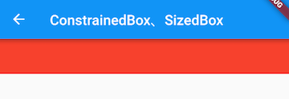
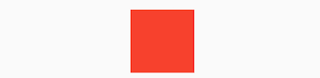
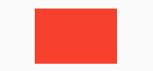

# 布局原理与约束（constraints）

## 目录

1. BoxConstraints
2. ConstrainedBox
3. SizedBox
4. 多重限制
5. UnconstrainedBox
6. 其它约束类容器

### 尺寸限制类容器
用于限制容器大小。
#### 类型
1. ConstrainedBox (约束盒子)
2. SizedBox (尺寸盒子)
3. UnconstrainedBox (未约束盒子)
4. AspectRatio (宽高比)
5. ...

### 布局模型
#### 类型
1. 基于 <font color=#dea32c>**RenderBox**</font> 的盒模型布局。
2. 基于 <font color=#dea32c>**Sliver**</font> ( RenderSliver ) <font color=#00a6ac>**按需加载**</font>列表布局。

#### 布局流程
1. 上层组件向下层组件传递约束（constraints）条件。
2. 下层组件确定自己的大小，然后告诉上层组件。
3. 上层组件确定下层组件相对于自身的偏移和确定自身的大小。

> 比如，父组件传递给子组件的约束是“最大宽高不能超过100，最小宽高为0”，如果我们给子组件设置宽高都为200，则子组件最终的大小是100*100。

### 盒模型布局组件
1. 组件对应的渲染对象都继承自 RenderBox 类。
2. 在布局过程中父级传递给子级的约束信息由 BoxConstraints 描述。

***

## BoxConstraints

盒模型布局过程中，父渲染对象传递给子渲染对象的约束信息。

``` dart
/// 子组件大小需要在约束的范围内
const BoxConstraints({
  this.minWidth = 0.0, //最小宽度
  this.maxWidth = double.infinity, //最大宽度
  this.minHeight = 0.0, //最小高度
  this.maxHeight = double.infinity //最大高度
})
```

### 便捷构造函数
* BoxConstraints.tight(Size size)：生成固定宽高的限制。
* BoxConstraints.expand()：生成一个尽可能大的用以填充另一个容器的BoxConstraints。
* ...

***

## ConstrainedBox

用于对子组件添加额外的约束。

> 例如，想让子组件的最小高度是80像素，可以使用const BoxConstraints(minHeight: 80.0)作为子组件的约束。

### 示例
``` dart
/// 定义一个红色背景的box
Widget redBox = DecoratedBox(
  decoration: BoxDecoration(color: Colors.red),
);
```
``` dart
ConstrainedBox(
  constraints: BoxConstraints(
    minWidth: double.infinity, /// 宽度尽可能大
    minHeight: 50.0 /// 最小高度为50像素
  ),
  child: Container(
    /// 虽然将Container的高度设置为5像素，但是最终却是50像素
    height: 5.0, 
    child: redBox ,
  ),
)
```



***

## SizedBox
用于给子元素指定固定的宽高
``` dart
SizedBox(
  width: 80.0,
  height: 80.0,
  child: redBox
)
```


实际上SizedBox只是ConstrainedBox的一个定制，它们都是通过<font color=#dea32c>**RenderConstrainedBox**</font>来渲染的（createRenderObject()方法都返回的是一个RenderConstrainedBox）。
``` dart
/// 等价代码
ConstrainedBox(
  /// BoxConstraints(minHeight: 80.0,maxHeight: 80.0,minWidth: 80.0,maxWidth: 80.0)
  constraints: BoxConstraints.tightFor(width: 80.0,height: 80.0),
  child: redBox, 
)
```

***

## 多重限制

🤔 如果某一个组件有多个父级ConstrainedBox限制，那么最终会是哪个生效？

``` dart
ConstrainedBox(
  constraints: BoxConstraints(
    minWidth: 60.0, 
    minHeight: 60.0 /// 生效
    ), //父
  child: ConstrainedBox(
    constraints: BoxConstraints(
      minWidth: 90.0, /// 生效
      minHeight: 20.0
      ),//子
    child: redBox,
  ),
)
```



``` dart
ConstrainedBox(
  constraints: BoxConstraints(
    minWidth: 90.0, /// 生效
    minHeight: 20.0 
    ),
  child: ConstrainedBox(
    constraints: BoxConstraints(
      minWidth: 60.0, 
      minHeight: 60.0 /// 生效
      ),
    child: redBox,
  )
)
```


### 总结
有多重限制时，对于minWidth和minHeight来说，是取父子中相应数值较大的。实际上，只有这样才能保证父限制与子限制不冲突。

***

## UnconstrainedBox
UnconstrainedBox 的子组件将不再受到约束，大小完全取决于自己。

一般情况下，很少会直接使用此组件，但在"去除"多重限制的时候也许会有帮助。

***

## 其它约束类容器
1. AspectRatio：指定子组件的长宽比。
2. LimitedBox：指定最大宽高。
3. FractionallySizedBox：可以根据父容器宽高的百分比来设置子组件宽高。
4. ...


