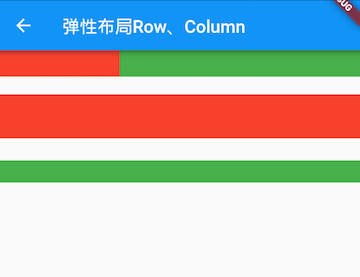

# 弹性布局（Flex）
允许子组件按照一定比例来分配父容器空间。

* Flex
* Expanded
  * Spacer 

## Flex
可以沿着水平或垂直方向排列子组件，Row和Column都继承自Flex。

可以和Expanded组件配合实现弹性布局。

``` dart
Flex({
  ...
  required this.direction, //弹性布局的方向, Row默认为水平方向，Column默认为垂直方向
  List<Widget> children = const <Widget>[],
})
```

Flex继承自MultiChildRenderObjectWidget，对应的RenderObject为RenderFlex，RenderFlex中实现了其布局算法。

# Expanded
只能作为 Flex（或其子类） 的孩子，可以按比例“扩伸”Flex子组件所占用的空间。
``` dart
const Expanded({
  /// 弹性系数
  /// 如果大于0，所有的Expanded按照其 flex 的比例来分割主轴的全部空闲空间
  int flex = 1, 
  required Widget child,
})
```

[运行代码](code/Expanded.dart)



示例中的Spacer的功能是占用指定比例的空间，实际上它只是Expanded的一个包装类

``` dart
class Spacer extends StatelessWidget {
  const Spacer({Key? key, this.flex = 1})
    : assert(flex != null),
      assert(flex > 0),
      super(key: key);
  
  final int flex;

  @override
  Widget build(BuildContext context) {
    /// 返回Expanded
    return Expanded(
      flex: flex,
      child: const SizedBox.shrink(),
    );
  }
}
```