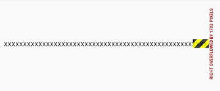
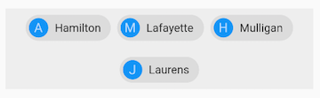
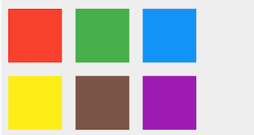

# 流式布局

1. Wrap
2. Flow

超出屏幕显示范围会自动折行的布局，避免Overflow。

通过Wrap和Flow来实现流式布局。

> ### Overflow
> 如果子 widget 超出屏幕范围，则会报溢出错误，如：
> ``` dart
> Row(
>   children: <Widget>[
>     Text("xxx"*100)
>   ],
> );
> ```
> 

***

## Wrap
``` dart
Wrap({
  ...
  this.direction = Axis.horizontal,
  this.alignment = WrapAlignment.start,
  /// 主轴方向子widget的间距
  this.spacing = 0.0,
  /// 纵轴方向的对齐方式
  this.runAlignment = WrapAlignment.start,
  /// 纵轴方向的间距
  this.runSpacing = 0.0,
  this.crossAxisAlignment = WrapCrossAlignment.start,
  this.textDirection,
  this.verticalDirection = VerticalDirection.down,
  List<Widget> children = const <Widget>[],
})
```

### 示例
[运行代码](code/Wrap.dart)



***

## Flow

### 优点
* <font color=#dea32c>**性能好**</font>；Flow是一个对子组件尺寸以及位置调整非常高效的控件，Flow用转换矩阵在对子组件进行位置调整的时候进行了优化：在Flow
定位过后，如果子组件的尺寸或者位置发生了变化，在FlowDelegate中的paintChildren()方法中调用context.paintChild 进行重绘，而context.paintChild在重绘时使用了转换矩阵，并没有实际调整组件位置。
* <font color=#dea32c>**灵活**</font>；由于我们需要自己实现FlowDelegate的paintChildren()方法，所以我们需要自己计算每一个组件的位置，因此，可以自定义布局策略。

### 缺点
* 使用<font color=#dea32c>**复杂**</font>。
* <font color=#dea32c>**不能自适应子组件大小**</font>，必须通过指定父容器大小或实现TestFlowDelegate的getSize返回固定大小。

### 示例
六个色块进行自定义流式布局。

[运行代码](code/Flow.dart)

