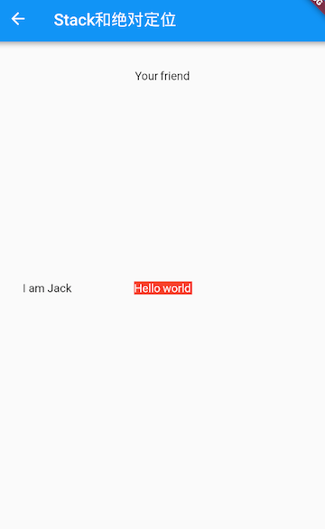
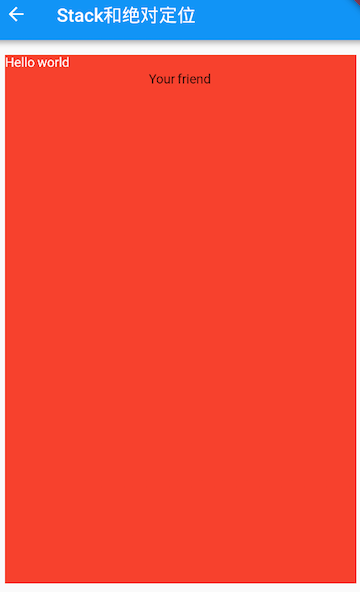

# 层叠布局 Stack、Positioned

使用Stack和Positioned这两个组件来配合实现绝对定位。

***

## Stack
允许子组件堆叠。
``` dart
Stack({
  /// left、right为横轴，top、bottom为纵轴
  /// 此处表示定位在左上角
  this.alignment = AlignmentDirectional.topStart,
  /// 用于确定alignment对齐的参考系
  this.textDirection,
  /// 用于确定没有定位的子组件如何去适应Stack的大小
  /// StackFit.loose表示使用子组件的大小
  /// StackFit.expand表示扩伸到Stack的大小
  this.fit = StackFit.loose,
  /// 决定对超出Stack显示空间的部分如何剪裁
  /// Clip.hardEdge 表示直接剪裁，不应用抗锯齿
  this.clipBehavior = Clip.hardEdge,
  List<Widget> children = const <Widget>[],
})
```
***
## Positioned
用于根据Stack的四个角来确定子组件的位置。
``` dart
const Positioned({
  Key? key,
  /// left、top 、right、 bottom分别代表离Stack左、上、右、底四边的距离
  this.left, 
  this.top,
  this.right,
  this.bottom,
  /// width和height用于指定需要定位元素的宽度和高度
  /// 在水平方向时，只能指定left、right、width三个属性中的两个
  /// 在垂直方向时，只能指定top、botton、height三个属性中的两个
  this.width,
  this.height,
  required Widget child,
})
```
***
## 示例1
过对几个Text组件的定位来演示Stack和Positioned的特性

[运行代码](code/Stack.dart)



## 示例2
上例中的Stack指定一个 <font color=#dea32c>**fit**</font> 属性，然后将三个子文本组件的顺序调整一下

[运行代码](code/Stack1.dart)



