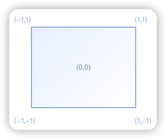

# 对齐与相对定位（Align）

1. Align
2. Alignment
3. FractionalOffset
4. Align和Stack对比
5. Center

***

## Align
可以调整子组件的位置。
``` dart
Align({
  Key key,
  /// 需要一个AlignmentGeometry类型的值，表示子组件在父组件中的起始位置
  /// AlignmentGeometry 是一个抽象类，它有两个常用的子类：Alignment和 FractionalOffset
  this.alignment = Alignment.center,
  /// 用于确定Align 组件本身宽高的属性
  /// 会分别乘以子元素的宽、高，最终的结果就是Align 组件的宽高
  /// 如果值为null，则组件的宽高将会占用尽可能多的空间
  this.widthFactor,
  this.heightFactor,
  Widget child,
})
```

### 示例
[运行代码](code/Align.dart)


***

## Alignment
继承自AlignmentGeometry，表示矩形内的一个点。

有两个属性x、y，分别表示在水平和垂直方向的偏移。

``` dart
Alignment(this.x, this.y)
```



可以通过其坐标转换公式将其坐标转为子元素的具体偏移坐标

``` dart
// childWidth为子元素的宽度，childHeight为子元素高度
(
  Alignment.x * childWidth/2 + childWidth/2, 
  Alignment.y * childHeight/2 + childHeight/2
)
```

***

## FractionalOffset

小数偏移，继承自 Alignment，唯一的区别就是坐标原点不同！

坐标原点为矩形的<font color=#dea32c>**左侧顶点**</font>，这和布局系统的一致。

坐标转换公式
> 实际偏移 = (FractionalOffse.x * childWidth, FractionalOffse.y * childHeight)

### 示例
[运行代码](code/FractionalOffset.dart)


***

## Align和Stack对比

### 相同点
都可以用于指定子元素相对于父元素的偏移。

### 不同点
1. 定位参考系统不同，Stack/Positioned定位的的参考系可以是父容器矩形的四个顶点；而Align则需要先通过alignment 参数来确定坐标原点，不同的alignment会对应不同原点，最终的偏移是需要通过alignment的转换公式来计算出。
2. Stack可以有多个子元素，并且子元素可以堆叠，而Align只能有一个子元素，不存在堆叠。

***
## Center

对齐方式为Alignment.center的Align。

``` dart
class Center extends Align {
  const Center({ Key? key, double widthFactor, double heightFactor, Widget? child })
    : super(key: key, widthFactor: widthFactor, heightFactor: heightFactor, child: child);
}
```

### 示例

演示当widthFactor或heightFactor为null时。

[运行代码](code/Center.dart)

