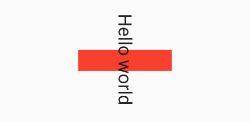
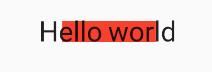
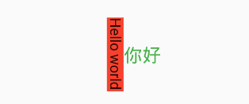

# 变换（Transform）

可以在其子组件绘制时对其应用一些矩阵变换来实现一些特效。

``` dart
Container(
  color: Colors.black,
  child: Transform(
    alignment: Alignment.topRight, //相对于坐标系原点的对齐方式
    /// Matrix4是一个4D矩阵，通过它我们可以实现各种矩阵操作
    /// 矩阵变化时发生在绘制时，而无需重新布局和构建等过程，所以性能很好
    transform: Matrix4.skewY(0.3), //沿Y轴倾斜0.3弧度
    child: Container(
      padding: const EdgeInsets.all(8.0),
      color: Colors.deepOrange,
      child: const Text('Apartment for rent!'),
    ),
  ),
)
```


***

## 平移

<font color=#dea32c>**Transform.translate**</font>

接收一个offset参数，可以在绘制时沿x、y轴对子组件平移指定的距离。

``` dart
DecoratedBox(
  decoration:BoxDecoration(color: Colors.red),
  // 默认原点为左上角，左移20像素，向上平移5像素  
  child: Transform.translate(
    offset: Offset(-20.0, -5.0),
    child: Text("Hello world"),
  ),
)
```

[运行代码](code/translate.dart)


***

## 旋转
<font color=#dea32c>**Transform.rotate**</font>

可以对子组件进行旋转变换。

``` dart
DecoratedBox(
  decoration:BoxDecoration(color: Colors.red),
  child: Transform.rotate(
    // 旋转90度
    angle: math.pi/2 ,
    child: Text("Hello world"),
  ),
)
```

[运行代码](code/rotate.dart)



***

## 缩放
<font color=#dea32c>**Transform.scale**</font>

可以对子组件进行缩小或放大。

``` dart
DecoratedBox(
  decoration:BoxDecoration(color: Colors.red),
  child: Transform.scale(
    scale: 1.5, //放大到1.5倍
    child: Text("Hello world")
  )
);
```
[运行代码](code/scale.dart)



***

## Transform 注意事项
Transform的变换是应用在绘制阶段，而并不是应用在布局(layout)阶段。

所以无论对子组件应用何种变化，其占用空间的大小和在屏幕上的位置都是固定不变的。

#### 举例说明：

[运行代码](code/TransformNotice.dart)


***

## RotatedBox

RotatedBox和Transform.rotate功能相似，都可以对子组件进行旋转变换。

RotatedBox的变换是在layout阶段，会影响在子组件的位置和大小。

#### 修改Transform.rotate的示例
[运行代码](code/RotatedBox.dart)


对比


由于RotatedBox是作用于layout阶段，所以子组件会旋转90度（而不只是绘制的内容）。

