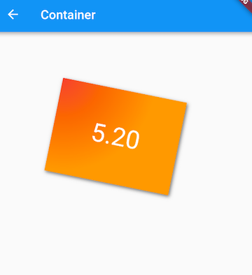
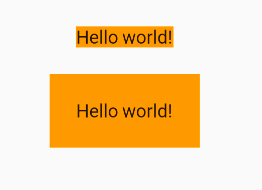

# Container

1. Container
2. Padding和Margin

Container是一个<font color=#dea32c>**组合类容器**</font>，本身不对应具体的RenderObject。

它是DecoratedBox、ConstrainedBox、Transform、Padding、Align 等组件组合的一个多功能容器。

``` dart
Container({
  this.alignment,
  this.padding, //容器内补白，属于decoration的装饰范围
  Color color, // 背景色
  Decoration decoration, // 背景装饰
  Decoration foregroundDecoration, //前景装饰
  double width,//容器的宽度
  double height, //容器的高度
  BoxConstraints constraints, //容器大小的限制条件
  this.margin,//容器外补白，不属于decoration的装饰范围
  this.transform, //变换
  this.child,
  ...
})
```

### 注意
1. 容器的大小可以通过width、height属性来指定，也可以通过constraints来指定。如果它们同时存在时，width、height优先。
2. color和decoration是互斥的，如果同时设置它们则会报错！

### 示例

实现如图所示卡片

[运行代码](code/ContainerCard.dart)



***

## Padding和Margin
研究一下Container组件margin和padding属性的区别
``` dart
...
Container(
  margin: EdgeInsets.all(20.0), //容器外补白
  color: Colors.orange,
  child: Text("Hello world!"),
),
Container(
  padding: EdgeInsets.all(20.0), //容器内补白
  color: Colors.orange,
  child: Text("Hello world!"),
),
...
```


