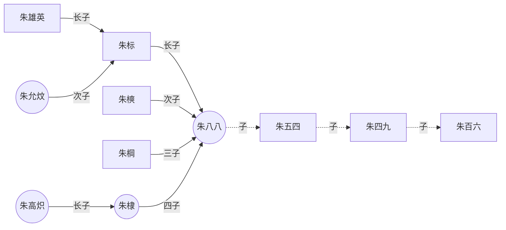

# 时序图

1. 简单示例
2. 声明参与者

## 简单示例
### 1. ->
用-> 来绘制参与者之间传递的消息。

```plantuml
用户 -> 认证中心
```

### 2. -->
使用 --> 绘制一个虚线箭头

```plantuml
用户 --> 认证中心
```

### 3. <- 和 <--
```plantuml
用户 <- 认证中心
```
```plantuml
用户 <-- 认证中心
```

### 示例
```plantuml
用户 -> 认证中心: 登录操作
认证中心 -> 缓存: 存放(key=token+ip,value=token)token
用户 <- 认证中心 : 认证成功返回token
用户 -> 认证中心: 下次访问头部携带token认证
认证中心 <- 缓存: key=token+ip获取token
其他服务 <- 认证中心: 存在且校验成功则跳转到用户请求的其他服务
其他服务 -> 用户: 信息
```
***
## 声明参与者

