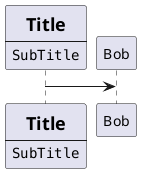
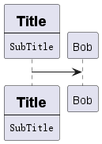

# 多行定义参与者

以对参与者使用多行定义。

### 不支持

``` puml
@startuml
participant Participant [
    =Title
    ----
    ""SubTitle""
]

participant Bob

Participant -> Bob
@enduml
```

### 支持

新建一个puml文件，右键点击图片，选择复制图标到剪贴板。

或者使用远程链接

