# 目录
1. OrgMode语法绘制
2. Markdown语法绘制
3. 运算符绘制(以上三种语法可以混合使用)
4. 多行表示
5. 多ROOT脑图(暂不支持)
6. 节点颜色
   1. 使用内联颜色
   2. 使用样式颜色
7. 移除方框
8. 改变图形方向

***

## 使用OrgMode语法绘制
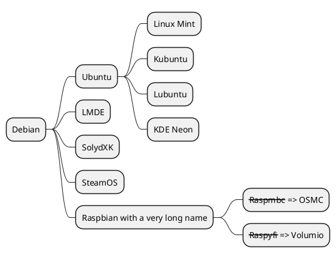

## Markdown语法绘制
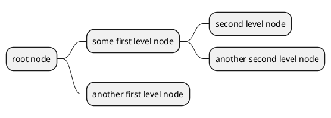
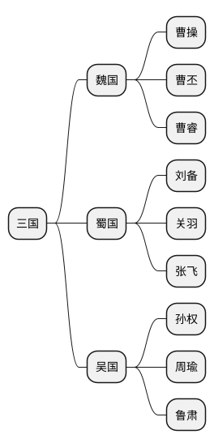

***
## 运算符绘制

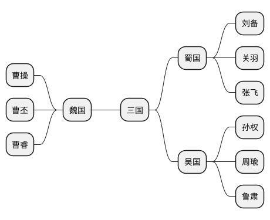

***

## 多行表示

你可以用 : 和 ; 包围文字，来表示多行文本。

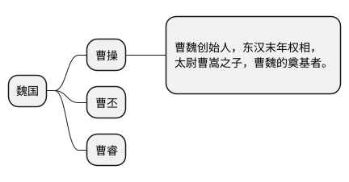

## 多ROOT脑图(暂不支持)
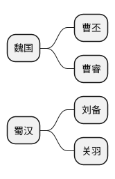
## 节点颜色

### 使用内联颜色
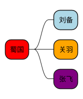

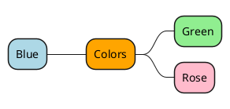

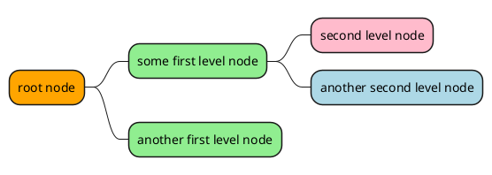

### 使用样式颜色
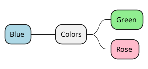

## 移除方框
以用下划线移除方框图。

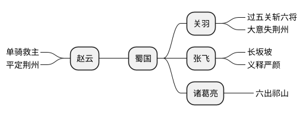

## 改变图形方向
可以同时使用图形的左右两侧。

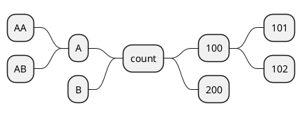

## 改变风格

### 节点、深度

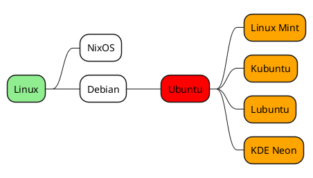

### 无盒
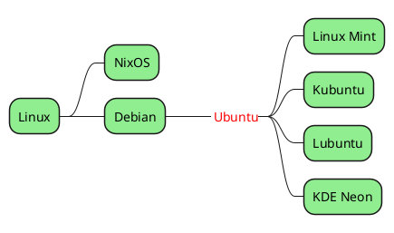

### 自动换行
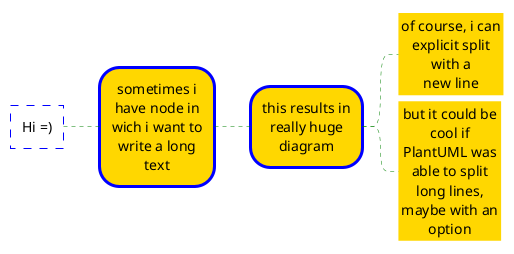
