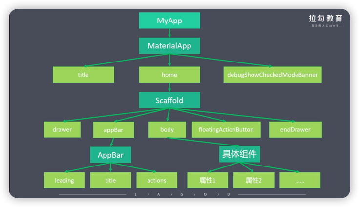
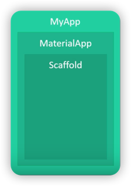
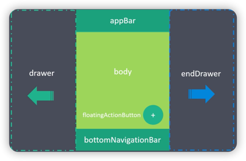
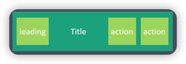

# App结构

***

* ### MaterialApp 材质应用
    * title 任务管理器或标签页中的标题
    * home 主内容
    * debugShowCheckedModeBanner 是否显示右上角debug标记
* ### Scaffold 脚手架
    * appBar 应用头部
    * body 应用主体
    * floatingActionButton 浮动按钮
    * drawer 左侧抽屉菜单
    * endDrawer 右侧抽屉菜单
    

### scaffold细分

### AppBar细分

***
[运行代码](code/App结构.dart)