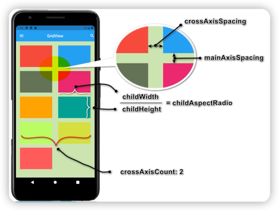

# GridView
* children 子组件
* scrollDirection 滚动方向
* gridDelegate 
    * SliverGridDelegateWithFixedCrossAxisCount 指定列数 - 子组件宽度自适应
    * SliverGridDelegateWithMaxCrossAxisExtent 指定子组件宽度 - 列数自适应
* 创建方式1：GridView.count 列数固定
* 创建方式2：GridView.extend 子组件宽度固定
* 创建方式3：GridView.builder 动态网格布局

***
[运行代码](code/GridView.dart)
  