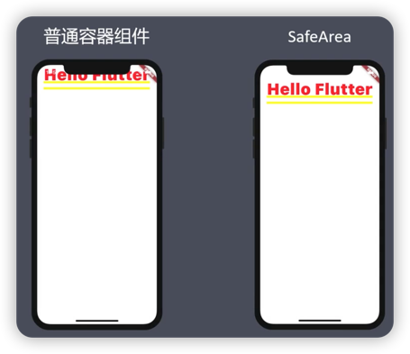
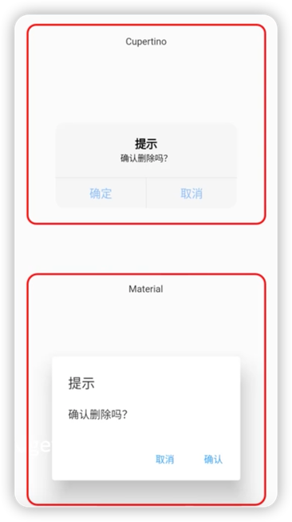

# Cupertino
* Material
    * 安卓风格组件
    * import 'package:flutter/material.dart'
    
* Cupertino
    * IOS风格组件
    * import 'package:flutter/cupertino.dart'
  
* 判断平台信息
    * Platform.isIOS
    * Platform.isAndroid

* SafeArea
    * 可以有效解决顶部刘海屏和底部圆角屏的问题。

    

***
[运行代码](code/Cupertino.dart)