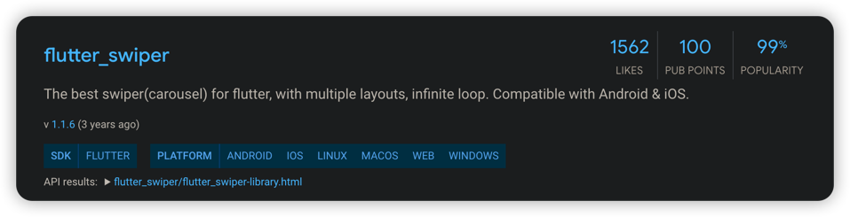

# flutter_swiper



[运行代码](code/flutter_swiper.dart)

***

### 安装

在pubspec.yaml添加如下，并执行flutter packages get

``` yaml
flutter_swiper : ^lastest_version
```

### 基本用法

``` dart
import 'package:flutter/material.dart';
import 'package:flutter_swiper/flutter_swiper.dart';

// ...

class _MyHomePageState extends State<MyHomePage> {

  @override
  Widget build(BuildContext context) {
    return new Scaffold(
      // ...
      // 新建一个Swiper
      body:  new Swiper(
        // 构建每个页显示内容
        itemBuilder: (BuildContext context,int index){
          return new Image.network("http://via.placeholder.com/350x150",fit: BoxFit.fill,);
        },
        // 指定页数
        itemCount: 3,
        // 指定翻页器
        pagination: new SwiperPagination(),
        // 指定控制器
        control: new SwiperControl(),
      ),
    );
  }
}
```

### 构造方法

#### 基本
| 参数              | 默认值                            | 描述                                   |
|-----------------|--------------------------------|--------------------------------------|
| scrollDirection | Axis.horizontal                | 决定是横向翻页还是竖向翻页。                       |
| loop            | true                           | 决定最后一页能否翻向第一页。                       |
| index           | 0                              | 默认显示第几页。                             |
| autoplay        | false                          | 设置为true打开自动轮播。                       |
| onIndexChanged  | void onIndexChanged(int index) | 翻页事件监听器。                             |
| onTap           | void onTap(int index)          | 当点击ui时触发。                            |
| duration        | 300.0                          | 翻页动画持续时间。                            |
| pagination      | null                           | 设为 new SwiperPagination() 来显示默认的翻页器。 |
| control         | null                           | 设为 new SwiperControl() 来显示默认的控制按钮。   |

#### Pagination 翻页器


#### Control buttons