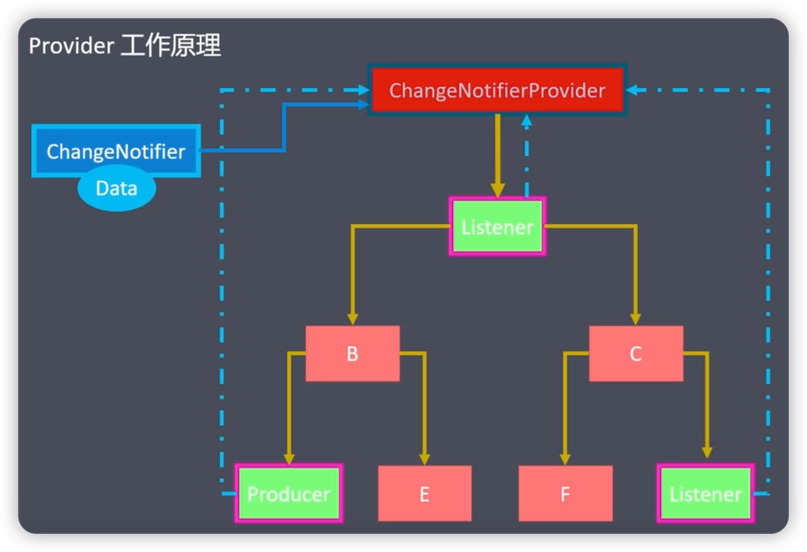
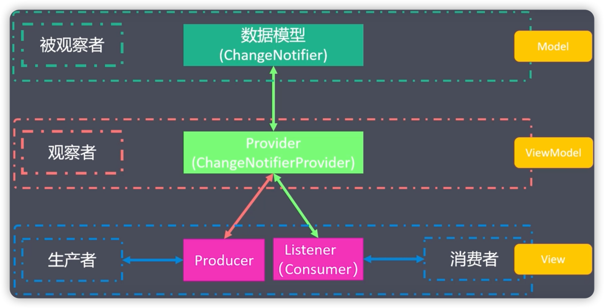

# Provider
是对InheritedWidget的封装。

地址：https://pub.dev/packages/provider

[运行代码](code/Provider.dart)

### 优点
1. 简化资源的分配与处置
2. 支持懒加载

### 实现原理

### 使用
1. 安装
2. 创建数据模型(T extends ChangeNotifier)
3. 创建Provider(注册数据模型)
    1. Provider() // 不会被要求随着变动二变动
    2. ChangeNotifierProvider() // 随着某些数据改变而被通知更新
4. 获取数据模型并更新UI
    1. 通过上下文(BuildContext)
    2. 通过静态方法(Provider.of<T>(context))