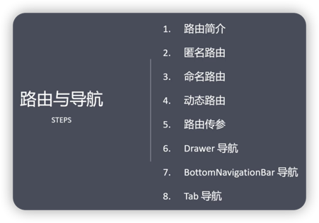

# 匿名路由

***

### 路由简介
Route：一个路由是一个屏幕或页面的抽象。

Navigator：管理路由的组件。通过路由入栈和出栈来实现页面的跳转。

常用属性
1. initialRoute，初始路由，即默认页面。
2. onGenerateRoute，动态路由(根据规则，匹配动态路由)。
3. onUnknownRoute，未知路由，也就是404。
4. routes，路由集合。