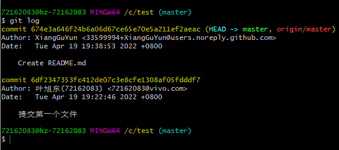
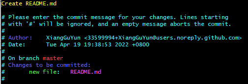
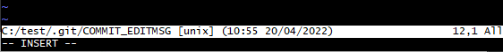
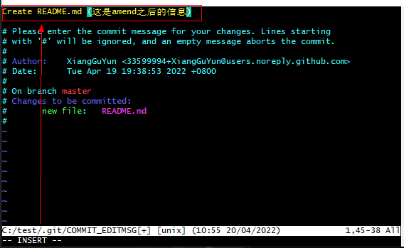
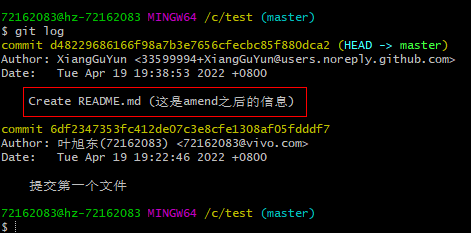

# Git amend 修改纠正
***
## 使用场景
1. 提交代码后，发现有处改错了，下次提交时不想保留上次记录。
2. 上次提交的message有误。

## 使用举例
1. git log之后，可以看到你之前提交过的git历史：

2. 执行git commit --amend。

翻译
> Create README (💡上次提交的描述)
>  
> 请为你的修改输入提交信息，以'#'为起始的行将会被忽略，而不输入任何信息表示放弃此次提交。
> 
> 作者： 提交人。
> 
> 日期： 提交时间。
> 
> 在 master 分支上。
> 
> 修改内容被提交：
> 
> 新文件： README

如果只是想修改描述信息

按下i，最后一行会出现 -- INSERT --。

使用键盘的↑键移动到黄色文字的那行，然后修改提交信息。

修改完成后，按下 Esc键退出编辑模式完成提交。

再 git log 看一下提交日志：

