# GIT入门
***
## 创建新仓库

1. 创建新文件夹并打开。
2. 执行 git init，创建新的 git 仓库。

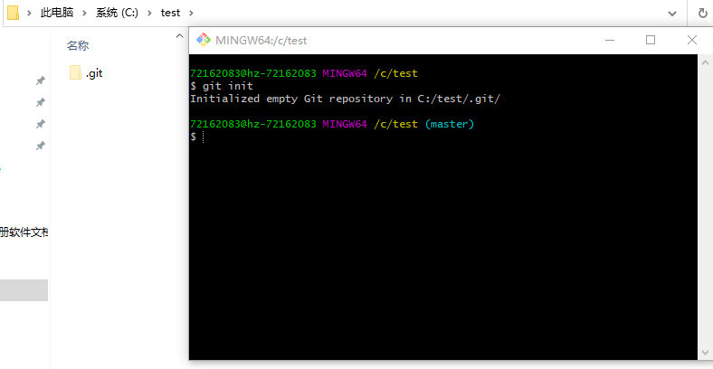

<br>

***
## 检出仓库
执行如下命令以创建一个本地仓库的克隆版本：

> git clone /path/to/repository

如果是远端服务器上的仓库，你的命令会是这个样子：
> git clone username@host:/path/to/repository

<br>

***
## 工作流
你的本地仓库由 git 维护的三棵“树”组成。
1. 第一个是你的 工作目录，它持有实际文件；
2. 第二个是 暂存区（Index），它像个缓存区域，临时保存你的改动；
3. 最后是 HEAD，它指向你最后一次提交的结果。


<br>

***
## 添加和提交
你可以提出更改（把它们添加到暂存区），使用如下命令：
> git add <filename>
> git add *

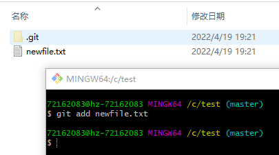

这是 git 基本工作流程的第一步；使用如下命令以实际提交改动：

> git commit -m "代码提交信息"

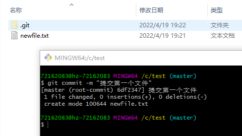

现在，你的改动已经提交到了 HEAD，但是还没到你的远端仓库。

<br>

***
## 推送改动
你的改动现在已经在本地仓库的 HEAD 中了。

执行如下命令以将这些改动提交到远端仓库：
> git push origin master

可以把 master 换成你想要推送的任何分支。

如果你还没有克隆现有仓库，并欲将你的仓库连接到某个远程服务器，你可以使用如下命令添加：

> git remote add origin <server>

如此你就能够将你的改动推送到所添加的服务器上去了。

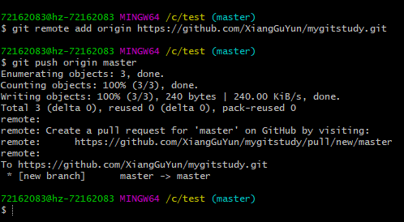

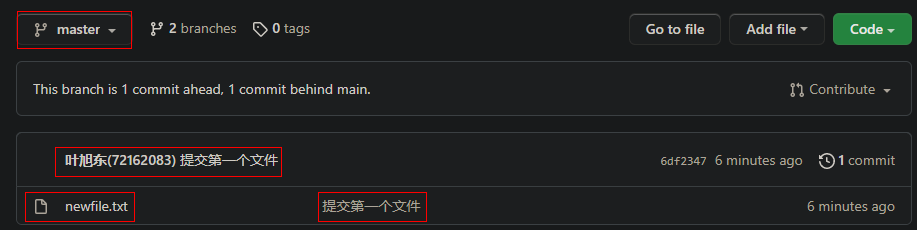

<br>

***
## 分支
分支是用来将特性开发绝缘开来的。在你创建仓库的时候，master或main是“默认的”分支。在其他分支上进行开发，完成后再将它们合并到主分支上。
 
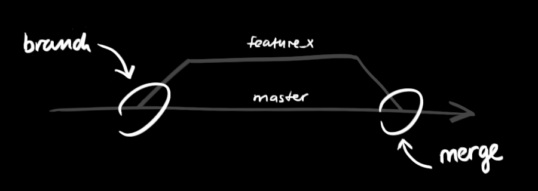

查看当前分支

> git branch

创建一个叫做“feature_x”的分支，并切换过去：
> git checkout -b feature_x

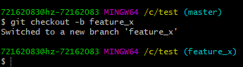

切换回主分支：
> git checkout master

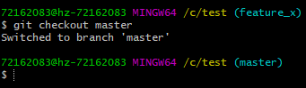

再把新建的分支删掉：
> git branch -d feature_x

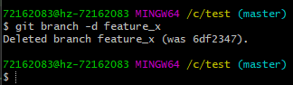

除非你将分支推送到远端仓库，不然该分支就是 不为他人所见的：
> git push origin <branch>

<br>

***
## 更新与合并
### 1. git pull
要更新你的本地仓库至最新改动，执行：

> git pull
1. 先在远端创建一个README文件。

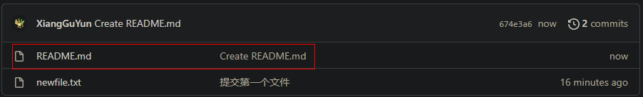

2. 使用git pull拉取远端新文件

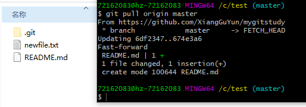

> 💡 在执行git pull的时候，如果提示当前branch没有跟踪信息：
> 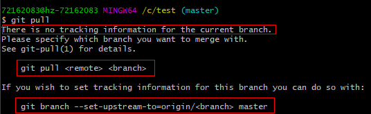
> 
> 对于这种情况有两种解决办法，就以master分支为例，
> 
> 方案①：直接指定远程master：
> >git pull origin master
>
> 方案②：先指定本地master到远程的master，然后再去pull
> >git branch --set-upstream-to=origin/master master
> 
> >git pull

<br>

### 2. git merge
以在你的工作目录中 获取（fetch） 并 合并（merge） 远端的改动。

要合并其他分支到你的当前分支（例如 master），执行：

```
git merge <branch>
```
> 
> 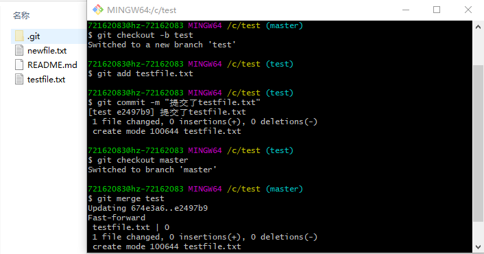
> 
> 1.切一个新分支，命名为test。
> 
> 2.添加一个testfile.txt文件并提交。
> 
> 3.切回master分支。
> 
> 4.执行 git merge test 命令，将test分支的内容合并到master上。


在这两种情况下，git 都会尝试去自动合并改动。遗憾的是，这可能并非每次都成功，并可能出现冲突（conflicts）。 
这时候就需要你修改这些文件来手动合并这些冲突（conflicts）。
改完之后，你需要执行 git add <filename> 命令以将它们标记为合并成功：

> 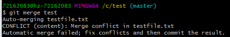
>
> 我在两个分支上都修改了testfile.txt，然后执行merge命令，显示冲突。
>
> 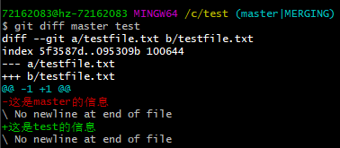
> 
> 然后执行diff命令查看冲突，红色文字表示当前分支冲突数据。
> 
> 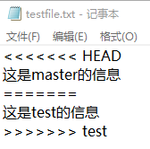
> 
> 打开testfile.txt，也能看到冲突。

<br>

***
## 替换本地改动

假如你操作失误（当然，这最好永远不要发生），你可以使用如下命令替换掉本地改动：

```
git checkout -- <filename>
```
此命令会使用 HEAD 中的最新内容替换掉你的工作目录中的文件。

已添加到暂存区的改动以及新文件都不会受到影响。

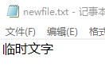

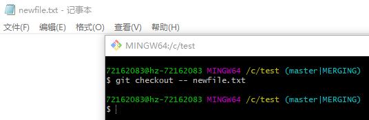

假如你想丢弃你在本地的所有改动与提交，可以到服务器上获取最新的版本历史，并将你本地主分支指向它：

```
git fetch origin

git reset --hard origin/master
```

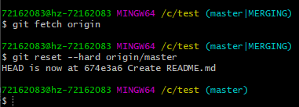

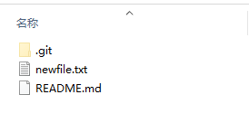

之前提交到本地的testfile.txt没有了。

<br>